<h1 id="microforge" align="center" style="font-size:40px;">
 <b>⚒️MicroForge🗡️</b>
 <p align="center" style="font-size:12px;"><em>
<br> Kickstart your microservices projects with secure authentication,
  <br>scalable services, automated CI/CD pipelines, and built-in monitoring.</em></p>
</h1>

[](https://github.com/MetalCloud1/MicroForge/actions/workflows/ci-cd.yaml) \
 \
 \
 \


> ⚠️ Currently using `latest`. Version **2.0** will remove `latest` and provide fixed releases.

**MicroForge** is a cloud-native microservices template designed to provide developers with a fully functional, scalable, and organized infrastructure foundation. It includes key components like monitoring, Terraform-based IaC, environment management, CI/CD, good testing and mocking practices, and essential microservices. The goal is to allow developers to focus on creating, updating, and extending services without the complexity of setting up the underlying infrastructure.

<p align="center">

❗ Version: **_initial/primitive_** (may contain minor issues).</p>

<hr/>

<h1 id="table-of-content" align="center">📋 Table Of Content</h1>

<ol>

  <li><a href="#project-overview">🔍 Project Overview</a></li>

  <li><a href="#architecture">🏗️ Architecture</a></li>

  <li><a href="#folder-structure">📂 Folder Structure</a></li>

  <li><a href="#ci-cd-pipeline">🔄 CI/CD Pipeline</a></li>

  <li><a href="#microservices">📦 Microservices</a></li>

  <li><a href="#observability">🛰️ Observability</a></li>

  <li><a href="#roadmap">📍 Roadmap</a></li>

  <li><a href="#quick-start">⚡ Quick Start</a></li>

  <li><a href="#run-everything-localdemo">🏃 Run everything (local/demo)</a></li>

  <li><a href="#testing--ci-details">🧪 Testing & CI details</a></li>

  <li><a href="#contributing--license">🤝 Contributing & License</a></li>

  <li><a href="#pre-publish-checklist">✅ Pre-publish checklist</a></li>

  <li><a href="#notes">📝 Notes</a></li>

</ol>

<hr/>

<h1 id="project-overview" align="center">

🔍 Project Overview

</h1>

<p>
MicroForge is a professional microservices template including:
</p>

<ul>
  <li><strong>Infrastructure as Code</strong>: Terraform manages PostgreSQL RDS, AWS Secrets Manager, and Kubernetes resources.</li>
  <li><strong>Kubernetes Deployments</strong>: Deployments, Services, Namespaces, ServiceAccounts, OIDC/IAM roles (IRSA).</li>
  <li><strong>CI/CD</strong>: GitHub Actions workflows for automated testing, linting, building Docker images, and optional deployment to AWS.</li>
  <li><strong>Security</strong>: Environment-specific secrets, AWS Secrets Manager integration, and secure password hashing.</li>
  <li><strong>Observability</strong>: Prometheus metrics, Loki JSON logs, Grafana dashboards ready for use.</li>
  <li><strong>Microservices</strong>: <code>auth_service</code> with full authentication flow, and <code>users-api</code> as a minimal, reusable scaffold service.</li>
</ul>

<hr/>

<h1 id="architecture" align="center">

🏗️ Architecture

</h1>

<p align="center">
  
</p>

<hr/>

<h1 id="folder-structure" align="center">

📂 Project Structure

</h1>

<h2 id="project-overview-diagram" align="center">

1️⃣ Project Overview

</h2>

<p align="center"></p>

<h2 id="repo-workflows" align="center">

2️⃣ Repository Workflows

</h2>

<p align="center"></p>

<h2 id="auth-service-diagram" align="center">

3️⃣ Auth Service

</h2>

<p align="center"></p>

<h2 id="monitoring-diagram" align="center">

4️⃣ Monitoring

</h2>

<p align="center"></p>

<h2 id="terraform-diagram" align="center">

5️⃣ Terraform

</h2>

<p align="center"></p>

<h2 id="demo-service-diagram" align="center">

6️⃣ Template / Demo Service

</h2>

<p align="center"></p>

<hr/>

<h1 id="ci-cd-pipeline" align="center">

🔄 CI/CD Pipeline

</h1>

<p align="center">
  
</p>

<p><strong>Workflow summary</strong>:</p>
<ol>
  <li><code>lint</code> → static checks (ruff / mypy / black)</li>
  <li><code>test</code> → unit + integration tests (<code>pytest</code>)</li>
  <li><code>build</code> → Docker image build & tag</li>
  <li><code>publish</code> → push image to registry (optional)</li>
  <li><code>deploy</code> → manual/automated deployment to staging/production</li>
</ol>

<hr/>

<h1 id="microservices" align="center">📦 Microservices</h1>

<ul>
  <li><strong>Auth Service (<code>auth_service</code>)</strong> — Full authentication flow: registration, email verification, JWT login/refresh, password hashing, user management.</li>
  <li><strong>Users API (<code>users-api</code>)</strong> — Minimal scaffold service: health endpoint, basic CRUD layout, designed to be copied & extended.</li>
</ul>

<hr/>

<h1 id="observability" align="center">🛰️ Observability</h1>

<ul>
  <li><strong>Prometheus</strong> — instrumented FastAPI metrics via <code>prometheus_fastapi_instrumentator</code>.</li>
  <li><strong>Grafana</strong> — dashboards (latency, throughput, errors) provided as JSON; ready to be provisioned via Helm.</li>
  <li><strong>Loki</strong> — structured JSON logs using <code>loguru</code> for advanced log queries.</li>
</ul>

<hr/>

<h1 id="roadmap" align="center">
📍 Roadmap
</h1>

<p align="center"></p>

<p><strong>Planned near-term improvements:</strong></p>
<ul>
  <li>2.0: pin releases (no <code>latest</code>), streamline Helm charts for demo deploys</li>
  <li>Add OAuth2 / social login options</li>
  <li>Add alerting rules for Prometheus + Grafana alertmanager</li>
  <li>Harden Terraform modules; add automated IaC tests</li>
</ul>

<hr/>

<h1 id="quick-start" align="center">⚡ Quick Start</h1>

<h2 id="prerequisites" align="center">Pre-requisites</h2>

<ul>
  <li>Docker & Docker Compose (for local/demo)</li>
  <li>Python 3.11+</li>
  <li>PostgreSQL (local or managed) — or use the provided Docker image</li>
  <li><code>kubectl</code>, <code>helm</code> (if testing Kubernetes/Helm flows)</li>
  <li>(Optional) AWS CLI + credentials for Terraform / real deployments</li>
</ul>

<h2 id="service-local" align="center">Local dev (service-level)</h2>

```bash
git clone https://github.com/MetalCloud1/MicroForge.git
cd MicroForge/auth_service
python -m venv .venv && source .venv/bin/activate
pip install -r requirements.txt -r requirements-test.txt

export POSTGRES_USER=authuser
export POSTGRES_PASSWORD=authpass
export POSTGRES_DB=authdb
export POSTGRES_HOST=localhost
export SECRET_KEY=dev_secret
export SENDER_EMAIL=<your_email>
export SENDER_PASSWORD=<your_email_password>

uvicorn src.main:app --reload --port 8000
```

Test endpoints using curl or Postman: `/register`, `/verify-email`, `/token`, `/users/me`.

<hr/>

<h1 id="run-everything-localdemo" align="center">🏃 Run everything (local / demo)</h1>

<p>Two recommended ways to bring the stack up quickly for demo/testing:</p>

<h2 id="docker-compose-demo" align="center">
1) Docker Compose (quick demo)
</h2>

<p>Use the included demo compose to run core services locally (Postgres, auth_service, users-api, Prometheus, Loki, Grafana):</p>

```bash
docker-compose -f docker/docker-compose.demo.yml up --build -d
```

<p><em>Notes:</em></p> <ul> <li><code>docker/docker-compose.demo.yml</code> is opinionated for local demos and uses ephemeral storage.</li> <li>Use <code>.env.example</code> as a template for environment variables; copy to <code>.env</code> and edit before running.</li> </ul> 

<h2 id="k8s-helm-demo" align="center">2) Kubernetes / Helm (more realistic)</h2>

 <p>Use Helm to deploy a more production-like environment with monitoring and services:</p>

```bash
helm repo add grafana https://grafana.github.io/helm-charts
helm repo add prometheus-community https://prometheus-community.github.io/helm-charts
helm repo update

helm upgrade --install loki-stack grafana/loki-stack -n monitoring -f monitoring/values.yaml --create-namespace

helm upgrade --install prom-stack prometheus-community/kube-prometheus-stack -n monitoring -f monitoring/prometheus-values.yaml
```

<p>Use the extracted <code>values.yaml</code> files in the <code>monitoring/</code> directory for consistency with your current deployment.</p> <hr/> 

<h1 
id="testing--ci-details" align="center">

🧪 Testing & CI details

</h1> 

<h2 id="run-tests" align="center">

Run tests locally

</h2>

```bash
pytest -q

pytest --cov=src --cov-report=term-missing
```
<h2 id="linting" align="center">
Linting / static checks
</h2>

```bash
ruff check .
black --check .
mypy src
```

<h2 id="ci-workflow" align="center">CI pipeline (GitHub Actions)
</h2> 

<p>The repo includes a GitHub Actions workflow that runs on PRs and pushes to <code>dev</code>/<code>main</code>. Flow:</p> <ul> <li><code>on: pull_request</code> → run lint + tests</li> <li><code>on: push: branches: [dev]</code> → build docker images, run integration tests</li> <li>Manual promotion → tag release & deploy</li> </ul> <hr/> 

<h1 id="contributing--license" align="center">

🤝 Contributing & License

</h1> 

<h2 id="contributing" align="center">

Contributing (short)

</h2> 

<p>This template is intended for learning, inspiration, and building new projects. If you'd like to contribute improvements:</p> <ul> <li>Open an issue describing the change / improvement.</li> <li>Send a PR against the <code>dev</code> branch.</li> <li>Respect the license: contact the author before public redistribution or claiming work as your own.</li> </ul> 

<h2 id="license" align="center">License (short)</h2> 

<p>This project is a <strong>template created by Gilbert Ramírez</strong> (GitHub: <a href="https://github.com/MetalCloud1">
https://github.com/MetalCloud1</a>).

</p> <p><strong>License:</strong> CC BY-NC-ND (custom) — full terms in <code>LICENSE.md</code>.

</p> <p><strong>You may:</strong></p> 

<ul> <li>View, study, and use this template for personal, educational, or inspiration purposes.</li> 

<li>Modify or extend it; substantial transformations that add new functionality may be used as your own work <strong>if you properly acknowledge the original template</strong>.</li> 

</ul> <p><strong>You may NOT:

</strong></p> <ul> <li>Claim the original template as entirely your own in resumes/portfolios without prior notice to the author.</li> <li>Sell, redistribute, or deploy the original template commercially without consent.</li> </ul> <p>

<strong>Author:</strong> Gilbert Ramírez (<a href="https://github.com/MetalCloud1">GitHub</a>)</p> <hr/> 

<h1 id="pre-publish-checklist" align="center">

✅ Pre-publish checklist</h1> 

<ul> <li>[ ] README finalized and screenshots/diagrams included</li> 

<li>[ ] LICENSE.md present</li> 

<li>[ ] <code>.gitignore</code> reviewed for secrets / private keys</li> 

<li>[ ] Local secrets removed</li>

 <li>[ ] Commits author/email consistent (<code>MetalCloud1</code> / <code>gilbertoismael5555@gmail.com</code>)</li>

  <li>[ ] Branch protection: protect <code>main</code>, require PR reviews, CI checks</li> 

  <li>[ ] Optional: <code>CONTRIBUTING.md</code>, <code>CODE_OF_CONDUCT.md</code>, <code>SECURITY.md</code>
  </li> </ul> <hr/> 


  <h1 id="notes" align="center">

  📝 Notes

  </h1> <ul> 

  <li>Focus: robust template for microservices, infrastructure, observability.</li> 

  <li>Docker Compose demo is ephemeral; use Kubernetes & Helm for realistic deployments.</li> 

  <li>Consider enabling GitHub Template to signal reusability.</li> </ul> 