<h1 align="center">🛡️ LeakGuard 🔐</h1>


*Quickly detect if your information (passwords, emails, etc.) has been compromised before it's too late.*

<p align="center">
  
  
  
  
</p>


**Version 1.0 — demo release**  
❗ Demo ready for testing. Production deployment optional and configurable.


## 🔍 Project Overview

**LeakGuard** is a set of microservices focused on **early leak detection**.  
It allows checking if passwords or other sensitive data appear in known breaches and sends alerts.  
This repo uses the **MicroForge** template to accelerate implementation and enforce best practices.

Main components:

- **Password Checker Service (`password_checker_service`)**: FastAPI app that checks passwords against the **Have I Been Pwned (HIBP)** public API using k-Anonymity (safe: full hash never sent).
- **Auth Service (`auth_service`)**: user management (registration, email verification, JWT, protected endpoints, rate-limiting).
- **PostgreSQL**: user persistence in Docker container (used by `auth_service`).
- **Observability**: Prometheus + Loki + Grafana for metrics, logs, and dashboards.
- **Testing & CI**: `pytest` + `unittest.mock` for deterministic tests; linters and formatters in CI.

---

## 🏗️ Architecture (summary)

1. Client → requests `/check-password` with Bearer token.
2. `password_checker_service` validates the token via `auth_service` (`/users/me`).
3. If the token is valid, queries **HIBP** using k-Anonymity (sends only first 5 chars of SHA-1).
4. Responds `{ leaked: bool, times: int }`.
5. Metrics and logs exported to Prometheus/Loki; dashboards in Grafana.

<p align="center">
  
</p>
---

## 📂 Repository Structure

<p align="center">
  
</p>


---

## ⚡ Quick Start (local / demo)

### Requirements
- Docker & Docker Compose (recommended)
- Python 3.11+
- (Optional) `uvicorn` to run services individually

### 1) Clone and run demo with Docker Compose

```bash
git clone https://github.com/MetalCloud1/leakguard.git
cd leakguard
# Apply all namespaces
kubectl apply -f auth_service/infra/k8s/dev/namespace-dev/
kubectl apply -f monitoring-namespace.yaml
```

This starts: `auth_service`, `password_checker_service`, Postgres (optional for auth), Prometheus, Loki, and Grafana.

### 2) Run only `password_checker_service` locally

```bash
cd password_checker_service
python -m venv .venv && source .venv/bin/activate
pip install -r requirements.txt -r requirements-test.txt
uvicorn src_pcs.app:app --reload --port 8001
```

Useful endpoints:

- `GET  http://localhost:8001/health`  
- `POST http://localhost:8001/check-password`  

`curl` example (requires valid token from `auth_service`):

```bash
curl -sS -X POST http://localhost:8001/check-password \
  -H "Authorization: Bearer <YOUR_TOKEN>" \
  -H "Content-Type: application/json" \
  -d '{"password":"123456"}'
```

Example response:

```json
{
  "leaked": true,
  "times": 1000000
}
```

---

## 🧩 Configuration (environment variables)

Service configurable via 12-factor environment variables:

- `AUTH_SERVICE_URL` — URL of authentication microservice (default `http://auth-service`).
- `USE_HIBP` — `"true"` / `"false"`. If `false`, service responds with fallback (useful for tests).
- `HIBP_TIMEOUT` — Timeout (seconds) for HIBP requests (default `5`).
- `LOG_LEVEL` — Logging level (`INFO`, `DEBUG`, `WARNING`).
- Standard Docker/Kubernetes vars (service names, networking).

**Note:** HIBP `range` endpoint requires no API key; other endpoints (e.g., `breachedaccount`) do, use `.env` or GitHub Secrets.

### Example `.env` (local)

```
AUTH_SERVICE_URL=http://localhost:8000
USE_HIBP=true
HIBP_TIMEOUT=5
LOG_LEVEL=INFO
```

---

## ✅ Secure design: k-Anonymity

- Service calculates SHA-1 of password locally.
- Sends only the first 5 characters (`prefix`) to `https://api.pwnedpasswords.com/range/{prefix}`.
- Receives list of suffixes and occurrences; compares suffix locally.
- Never sends full password or hash externally.

---

## 🧪 Tests & best practices for CI

Tests in `tests/test_password_checker.py` cover:

- `/health` endpoint (smoke test)
- `/check-password` with valid token (mocking `decode_token_return_username` and `check_password_hibp`)
- `/check-password` with invalid token (mocking `decode_token_return_username`)
- Fallback (`USE_HIBP=false`) — ensures env variable is read dynamically

### Run tests locally

```bash
pytest -q
```

### Coverage and linters

```bash
# Coverage
pytest --cov=src --cov-report=term-missing

# Lint / static analysis
ruff check .
black --check .
mypy src
```

### Recommended mocking in tests
- `decode_token_return_username` → avoids calling auth service.
- `check_password_hibp` → avoids real HIBP requests in CI.
- Avoid manipulating global vars at import time; read `USE_HIBP` per request or patch module var in tests.

---

## 🛠️ Implementation examples

### Dynamic `USE_HIBP` reading

```python
use_hibp = os.environ.get("USE_HIBP", "true").lower() == "true"
if use_hibp:
    times = check_password_hibp(request.password)
else:
    times = 0
```

### Mocking with pytest

```python
@patch("password_checker_service.src_pcs.app.decode_token_return_username")
@patch("password_checker_service.src_pcs.app.check_password_hibp")
def test_check_password_with_hibp(mock_hibp, mock_decode):
    mock_decode.return_value = "testuser"
    mock_hibp.return_value = 1000000
```

---

## 🛰️ Observability & monitoring

- **Prometheus**: FastAPI metrics — latency, request count, errors
- **Loki**: structured JSON logs for searching and correlation
- **Grafana**: preconfigured dashboards:
  - `API latency (p50/p95/p99)`
  - `Requests per second`
  - `Error rate (4xx vs 5xx)`
  - `Auth failures` (invalid token count)

Scraping configuration in `docker-compose.demo.yml` and `prometheus/prometheus.yml`.

---

## 🔐 Security & legal notes

- **Do not store passwords in plaintext** or user dumps in the repo.
- HIBP used in read-only k-Anonymity mode — recommended way to check passwords.
- Real account features (notifications, locks) require **explicit consent** and compliance (GDPR/LPD).
- Use `GitHub Secrets` for sensitive CI/CD variables; do not commit `.env`.

---

## 🚀 Production deployment suggestions

1. Containerize service (`Dockerfile`) and use `docker-compose` for staging.
2. Deploy on Render, Railway, AWS ECS/Fargate, Google Cloud Run, or Kubernetes (EKS/GKE).
3. Configure readiness/liveness probes and resource limits.
4. Enable TLS/HTTPS and WAF if public.
5. Set alerts in Grafana/Prometheus for high errors or request spikes.

---

## 🤝 Contribution & style guide

- Open an issue for proposed changes or bugs
- Submit PRs to `dev` branch
- Follow conventions:
  - `black` for formatting
  - `ruff` for linting
  - `mypy` for static typing
  - Tests using `pytest` and mocks as needed
- Maintain MicroForge attribution when using template

---

## 📄 License

Based on **MicroForge** template by Gilbert Ramírez (`MetalCloud1`).  
**License:** CC BY-NC-ND (see `LICENSE.md`).
