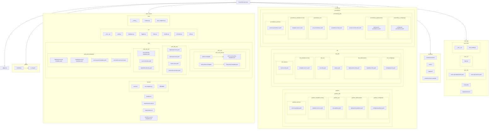

```mermaid
flowchart TD
    cloud[Cloud-Microservices]

    %% .github
    subgraph github[.github]
        workflows --> ci_cd[ci-cd.yaml]
    end
    cloud --> github

    %% auth_service
    subgraph auth_service
        subgraph alembic
            versions[versions]
            env_template[env-template.py]
            readme_alembic[README]
        end

        subgraph infra
            subgraph auth_iam
                subgraph auth_iam_policies
                    policies_template[policies-template]
                    auth_secret_policy[auth-secret-policy-template.json]
                    trust_policies[trust-policies-template]
                    trust_policy[trust-policy-template.json]
                    policies_template --> auth_secret_policy
                    trust_policies --> trust_policy
                end
            end

            subgraph auth_k8s_dev
                deployment_dev[deployment-dev.yaml]
                namespace_dev[namespace-dev.yaml]
                service_dev[service-dev.yaml]
                serviceAccount_dev[serviceAccount-dev.yaml]
            end

            subgraph auth_dev_db
                secret_db[secret-db-dev-template.yaml]
                service_db[service-db-dev.yaml]
                statefulset_db[statefulSet-db-dev.yaml]
            end

            subgraph auth_prod_templates
                deployment_prod[deployment-prod-template.yaml]
                namespace_prod[namespace-prod-template.yaml]
                service_prod[service-prod-template.yaml]
                serviceAccount_prod[serviceAccount-prod.yaml]
            end
        end

        subgraph src
            init_src[__init__.py]
            auth_py[auth.py]
            database_py[database.py]
            logger_py[logger.py]
            main_py[main.py]
            models_py[models.py]
            schemas_py[schemas.py]
            utils_py[utils.py]
        end

        subgraph tests
            init_tests[__init.py__]
            conftest[conftest.py]
            test_endpoints[test_endpoints.py]
        end

        alembic_ini[alembic.ini]
        requirements_test[requirements-test.txt]
        requirements[requirements.txt]
        terraform_secret[terraform-secret-template.json]
    end
    cloud --> auth_service

    %% monitoring (Grafana, Loki, Prometheus)
    subgraph monitoring[monitoring]
        %% grafana
        subgraph grafana
            subgraph grafana_k8s
                subgraph grafana_configmaps
                    configmap_grafana[configmap-grafana.yaml]
                end
                subgraph grafana_deployments
                    deployment_grafana[deployment-grafana.yaml]
                end
                subgraph grafana_pvc
                    pvc_grafana[pvc-grafana.yaml]
                end
                subgraph grafana_template-secrets
                    secret_grafana[template-secre-t.yaml]
                end
                subgraph grafana_services
                    service_grafana[service-grafana.yaml]
                end
            end
        end

        %% loki
        subgraph loki
            subgraph loki_k8s
                subgraph loki_configmaps
                    configmap_loki[configmap-loki.yaml]
                end
                subgraph loki_deployments
                    deployment_loki[deployments-loki.yaml]
                    statefulset_loki[statefulset-loki.yaml]
                end
                subgraph loki_pvc
                    pvc_loki[pvc-loki.yaml]
                end
                subgraph loki_template-secrets
                    secret_loki[template-secre-t.yaml]
                end
                subgraph loki_services
                    service_loki[service-loki.yaml]
                end
                values_loki[values.yaml]
            end
        end

        %% prometheus
        subgraph prometheus
            subgraph prometheus_k8s
                subgraph prometheus_configmaps
                    configmaps_prometheus[configmaps-prometheus.yaml]
                end
                subgraph prometheus_deployments
                    deployment_prometheus[deployment-prometheus.yaml]
                end
                subgraph prometheus_pvc
                    pvc_prometheus[pvc-prometheus.yaml]
                end
                subgraph prometheus_template-secrets
                    secret_prometheus[template-secre-t.yaml]
                end
                subgraph prometheus_services
                    service_prometheus[service-prometheus.yaml]
                end
                prometheus_rbac[prometheus-rbac.yaml]
                service_monitor[service-monitor-dev.yaml]
            end
        end
    end
    cloud --> monitoring

    %% terraform
    subgraph terraform
        terraform_lock[.terraform.lock.hcl]
        main_tf[main.tf]
        outputs_tf[outputs.tf]
        tfvars_example[terraform.tfvars.example]
    end
    cloud --> terraform

    %% user-api
    subgraph user_api
        subgraph user_k8s
            deployment_users[users-api-deployment.yaml]
            service_users[users-api-service.yaml]
        end

        subgraph user_src
            main_user[main.py]
        end

        subgraph user_tests
            init_user[__init__.py]
            test_health[test_health.py]
        end

        dockerfile[Dockerfile]
        requirements_user[requirements.txt]
    end
    cloud --> user_api

    gitignore[.gitignore]
    cloud --> gitignore
```
