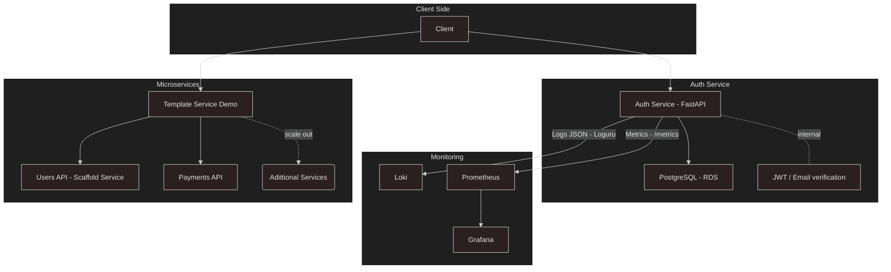
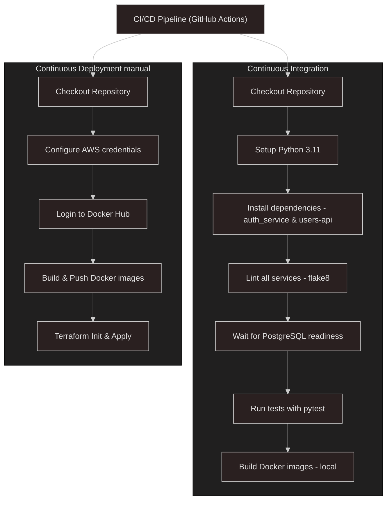
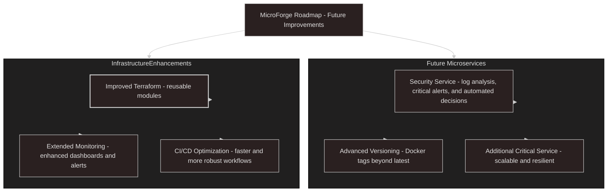

<h1 align="center">
 <b>⚒️MicroForge🗡️</b>
</h1>


**MicroForge** is a cloud-native microservices template designed to provide developers with a fully functional, scalable, and organized infrastructure foundation. It includes key components like monitoring, Terraform-based IaC, environment management, CI/CD, and essential microservices. The goal is to allow developers to focus on creating, updating, and extending services without the complexity of setting up the underlying infrastructure.
<p align="center">

❗ Version: **_initial/primitive_** (may contain minor issues).</p>

<h2 id="table-of-content" align="center">
📋Table Of Content
</h2>
<div align="center" style="font-size:17px;">
<ol>

1.[🔍Project Overview](#project-overview)

2.[🏗️Architecture](#architecture)

3.[📂Folder Structure](#folder-structure)

4.[🔄CI/CD Pipeline](#ci-cd-pipeline)

5.[📦Microservices](#microservices)

6.[🛰️Observability](#observability)

7.[📍Roadmap](#roadmap)

8.[⚡Quick Start](#quick-start)

9.[📝Notes](#notes)

</ol>
</div>

<h2 id="project-overview" align="center">🔍Project Overview</h2>

MicroForge provides a professional template with:

* **Infrastructure as Code**: Terraform manages PostgreSQL RDS, AWS Secrets Manager, and    Kubernetes resources.

* **Kubernetes Deployments**: Deployments, Services, Namespaces, ServiceAccounts, OIDC/IAM roles (IRSA).

* **CI/CD**: GitHub Actions workflows for automated testing, linting, building Docker images, and manual deployment to AWS.

* **Security**: Environment-specific secrets, AWS Secrets Manager integration, and secure password hashing.

* **Observability**: Prometheus metrics, Loki JSON logs, Grafana dashboards ready for use.

* **Microservices**: `auth_service` with full authentication flow, and `users-api` as a minimal, reusable scaffold service.

<h2 id="architecture" align="center">
🏗️Architecture
</h2>



<h2 id="folder-structure" align="center">
📂Folder Structure

```mermaid
---
config:
  theme: neo-dark
---
flowchart TD
    cloud[Cloud-Microservices]

    %% .github
    subgraph github[.github]
        workflows --> ci_cd[ci-cd.yaml]
    end
    cloud --> github

    %% auth_service
    subgraph auth_service
        subgraph alembic
            versions[versions]
            env_template[env-template.py]
            readme_alembic[README]
        end

        subgraph infra
            subgraph auth_iam
                subgraph auth_iam_policies
                    policies_template[policies-template]
                    auth_secret_policy[auth-secret-policy-template.json]
                    trust_policies[trust-policies-template]
                    trust_policy[trust-policy-template.json]
                    policies_template --> auth_secret_policy
                    trust_policies --> trust_policy
                end
            end

            subgraph auth_k8s_dev
                deployment_dev[deployment-dev.yaml]
                namespace_dev[namespace-dev.yaml]
                service_dev[service-dev.yaml]
                serviceAccount_dev[serviceAccount-dev.yaml]
            end

            subgraph auth_dev_db
                secret_db[secret-db-dev-template.yaml]
                service_db[service-db-dev.yaml]
                statefulset_db[statefulSet-db-dev.yaml]
            end

            subgraph auth_prod_templates
                deployment_prod[deployment-prod-template.yaml]
                namespace_prod[namespace-prod-template.yaml]
                service_prod[service-prod-template.yaml]
                serviceAccount_prod[serviceAccount-prod.yaml]
            end
        end

        subgraph src
            init_src[__init__.py]
            auth_py[auth.py]
            database_py[database.py]
            logger_py[logger.py]
            main_py[main.py]
            models_py[models.py]
            schemas_py[schemas.py]
            utils_py[utils.py]
        end

        subgraph tests
            init_tests[__init.py__]
            conftest[conftest.py]
            test_endpoints[test_endpoints.py]
        end

        alembic_ini[alembic.ini]
        requirements_test[requirements-test.txt]
        requirements[requirements.txt]
        terraform_secret[terraform-secret-template.json]
    end
    cloud --> auth_service

    %% monitoring (Grafana, Loki, Prometheus)
    subgraph monitoring[monitoring]
        %% grafana
        subgraph grafana
            subgraph grafana_k8s
                subgraph grafana_configmaps
                    configmap_grafana[configmap-grafana.yaml]
                end
                subgraph grafana_deployments
                    deployment_grafana[deployment-grafana.yaml]
                end
                subgraph grafana_pvc
                    pvc_grafana[pvc-grafana.yaml]
                end
                subgraph grafana_template-secrets
                    secret_grafana[template-secre-t.yaml]
                end
                subgraph grafana_services
                    service_grafana[service-grafana.yaml]
                end
            end
        end

        %% loki
        subgraph loki
            subgraph loki_k8s
                subgraph loki_configmaps
                    configmap_loki[configmap-loki.yaml]
                end
                subgraph loki_deployments
                    deployment_loki[deployments-loki.yaml]
                    statefulset_loki[statefulset-loki.yaml]
                end
                subgraph loki_pvc
                    pvc_loki[pvc-loki.yaml]
                end
                subgraph loki_template-secrets
                    secret_loki[template-secre-t.yaml]
                end
                subgraph loki_services
                    service_loki[service-loki.yaml]
                end
                values_loki[values.yaml]
            end
        end

        %% prometheus
        subgraph prometheus
            subgraph prometheus_k8s
                subgraph prometheus_configmaps
                    configmaps_prometheus[configmaps-prometheus.yaml]
                end
                subgraph prometheus_deployments
                    deployment_prometheus[deployment-prometheus.yaml]
                end
                subgraph prometheus_pvc
                    pvc_prometheus[pvc-prometheus.yaml]
                end
                subgraph prometheus_template-secrets
                    secret_prometheus[template-secre-t.yaml]
                end
                subgraph prometheus_services
                    service_prometheus[service-prometheus.yaml]
                end
                prometheus_rbac[prometheus-rbac.yaml]
                service_monitor[service-monitor-dev.yaml]
            end
        end
    end
    cloud --> monitoring

    %% terraform
    subgraph terraform
        terraform_lock[.terraform.lock.hcl]
        main_tf[main.tf]
        outputs_tf[outputs.tf]
        tfvars_example[terraform.tfvars.example]
    end
    cloud --> terraform

    %% user-api
    subgraph user_api
        subgraph user_k8s
            deployment_users[users-api-deployment.yaml]
            service_users[users-api-service.yaml]
        end

        subgraph user_src
            main_user[main.py]
        end

        subgraph user_tests
            init_user[__init__.py]
            test_health[test_health.py]
        end

        dockerfile[Dockerfile]
        requirements_user[requirements.txt]
    end
    cloud --> user_api

    gitignore[.gitignore]
    cloud --> gitignore

```

</h2>



<h2 id= "ci-cd-pipeline" align = "center">
🔄CI/CD Pipeline
</h2>




<h2 id="microservices" align = "center">
📦Microservices
</h2>

* **Auth Service** (`auth_service`)
Provides full authentication functionality including user registration, email verification, JWT-based login, and secure password handling.

* **Users API** (`users-api`)
Minimal, fully functional scaffold service that can be copied and extended. Demonstrates microservice structure, Kubernetes deployment, and basic endpoint (`/health`).

<h2 id="observability" align = "center">
🛰️Observability
</h2>

* **Prometheus**: Metrics from FastAPI endpoints (`/metrics`) via `prometheus_fastapi_instrumentator`.

* **Grafana**: Dashboards for latency, throughput, errors, ready to deploy via Helm.

* **Loki**: JSON structured logs via Loguru for advanced querying.

<h2 id="roadmap" align="center">
Roadmap📍
</h2>



<h2 id="quick-start" align = "center">
⚡Quick Start
</h2>

```bash
git clone <repo_url>
cd MicroForge/auth_service
python -m venv .venv && source .venv/bin/activate
pip install -r requirements.txt -r requirements-test.txt

export POSTGRES_USER=authuser
export POSTGRES_PASSWORD=authpass
export POSTGRES_DB=authdb
export POSTGRES_HOST=localhost
export SECRET_KEY=dev_secret
export SENDER_EMAIL=<your_email>
export SENDER_PASSWORD=<your_email_password>
```

```python
uvicorn src.main:app --reload --port 8000
```

Test endpoints using cURL or Postman (/register, /verify-email, /token, /users/me).

<h2 id="notes" align = "center">
📝Notes
</h2>

***📌Version**: Initial, may contain minor issues. The focus is on providing a robust template for microservices, infrastructure, and observability, not a polished production-ready system yet.

*📌**MicroForge** is designed to be extensible, scalable, and professional, allowing developers to focus on creating new services without worrying about infrastructure complexity.